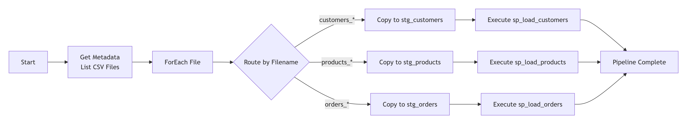

# 📊 Azure Data Factory Incremental Ingestion Pipeline
## 🚀 Overview

A production-style data pipeline that demonstrates enterprise data engineering practices using Azure services. This solution dynamically ingests CSV files, transforms data with business logic, and enforces data integrity with explicit error quarantine and traceability.

## 🏗️ Architecture
<p align="center">
  
</p>

### 📁 Data Model
#### 🗃️ Staging Layer (Raw Ingestion)

| Table | Purpose | Characteristics |
| :--- | :--- | :--- |
| **stg_customers** | Raw customer data | • Accepts duplicates<br>• No constraints<br>• Full history |
| **stg_products** | Raw product data | • Accepts duplicates<br>• No constraints<br>• Full history |
| **stg_orders** | Raw order transactions | • Accepts invalid FKs<br>• No constraints<br>• Full history |


### 🎯 Final Layer (Curated Data)

| Table | Type | Key Constraints | Purpose |
| :--- | :--- | :--- | :--- |
| **`customers`** | Dimension | `customer_id` (PK) | Deduplicated customer master |
| **`products`** | Dimension | `product_id` (PK) | Deduplicated product catalog |
| **`orders`** | Fact | `order_id` (PK)<br>`customer_id` (FK)<br>`product_id` (FK) | Validated transactions |

### ⚠️ Error Handling

| Table | Columns | Purpose |
| :--- | :--- | :--- |
| **`orders_error`** | • Invalid order data<br>• Error reason<br>• Source file<br>• Timestamp | Quarantined invalid records with full traceability |

## 🔄 Incremental Loading Strategy

### 📂 File-Level Processing

| Aspect | Detail |
| :--- | :--- |
| **File Pattern** | `customers_YYYY-MM-DD.csv` |
| **Processing** | Dynamic discovery via **Get Metadata** |
| **Advantage** | No hardcoded file lists |

---

### 📊 Record-Level Processing

To ensure data integrity, a SQL-based incremental insert strategy is used to prevent duplicates and ensure idempotency.

```sql
INSERT INTO final_table (col1, col2, ...)
SELECT s.col1, s.col2, ...
FROM staging_table s
LEFT JOIN final_table f
  ON s.business_key = f.business_key
WHERE f.business_key IS NULL;
```

#### Key Features:

* **✅ Idempotent:** Safe for multiple executions; won't create duplicate records if re-run.
* **✅ Incremental:** Processes only new records to avoid duplication.
* **✅ Scalable:** Optimized to handle growing data volumes efficiently.

### ⚙️ Azure Data Factory Pipeline

#### 🔧 Datasets
| Dataset | Type | Configuration | Purpose |
| :--- | :--- | :--- | :--- |
| **`InputFolderDataset`** | Azure Blob | Container path | File listing only |
| **`InputFileDataset`** | Azure Blob | Parameterized path | Read specific CSV |
| **`SqlStagingDataset`** | Azure SQL | Parameterized table | Write to staging |

## 🔄 Pipeline Flow

<p align="center">
  
</p>

### 🗃️ SQL Stored Procedures

| Procedure | Purpose | Logic |
| :--- | :--- | :--- |
| **`sp_load_customers`** | Load customer dimension | • Deduplicate by `customer_id`<br>• Insert new records only |
| **`sp_load_products`** | Load product dimension | • Deduplicate by `product_id`<br>• Insert new records only |
| **`sp_load_orders`** | Load order facts | • Validate foreign keys<br>• Insert valid orders<br>• Quarantine invalid orders |


### 🧠 Why Stored Procedures?

Business logic is implemented in SQL stored procedures to:
- Keep ADF focused on orchestration
- Enable independent testing of transformation logic
- Ensure idempotent and repeatable executions
- Improve maintainability and reusability

This separation reflects real-world enterprise data engineering practices.


## ✅ What This Project Demonstrates

- Dynamic file discovery in Azure Data Factory
- Incremental ingestion without hardcoded file lists
- Staging-to-curated data modeling
- SQL-based deduplication and FK validation
- Explicit error quarantining
- Idempotent pipeline design


> This project intentionally focuses on correctness, clarity, and production-style design
> rather than advanced optimizations or framework complexity.
